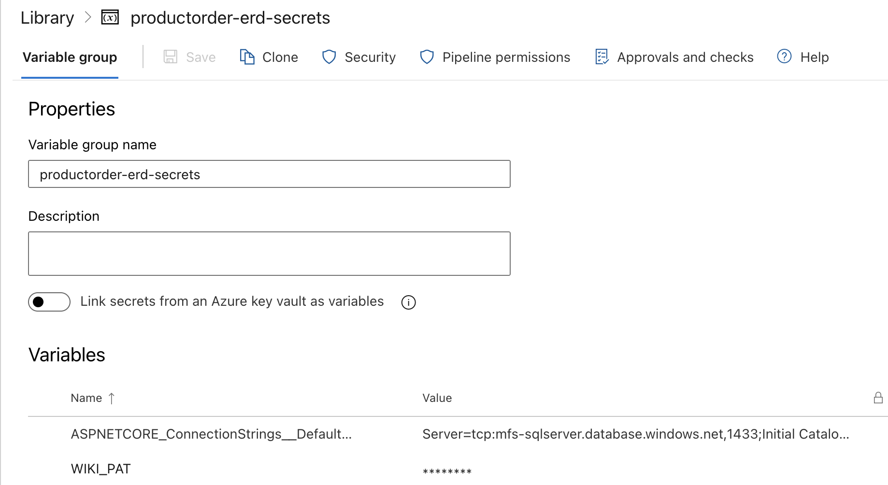
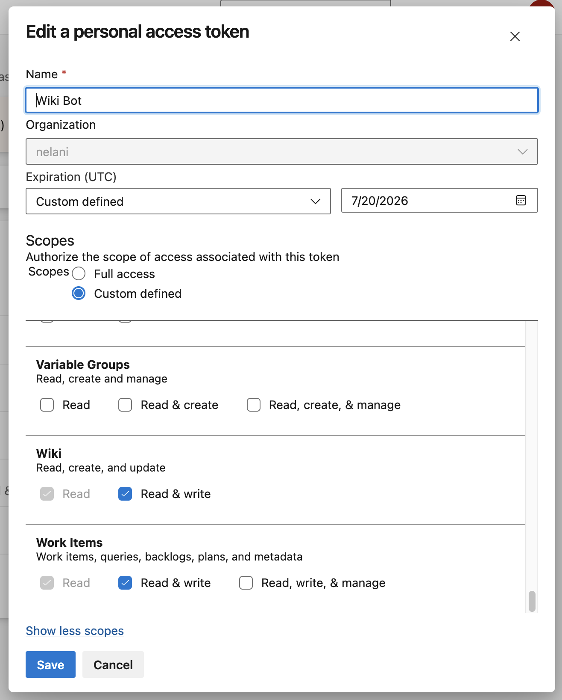
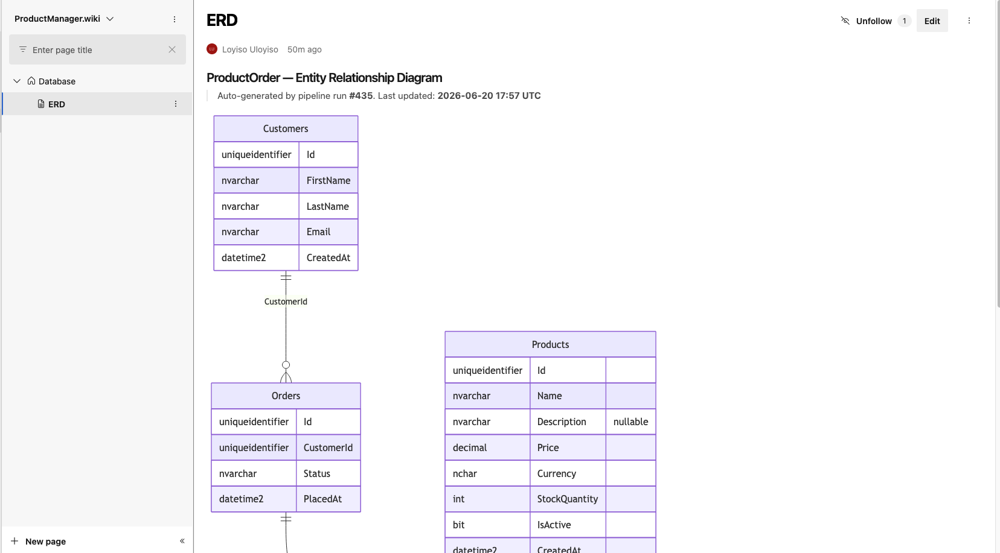

# Generate ERD Pipeline

Automatically generates a Mermaid Entity Relationship Diagram from the live **ProductOrder** Azure SQL schema and publishes it to the Azure DevOps project wiki at `Database/ERD`.

The diagram is always in sync with the real database — no manual updates, no stale diagrams.

---

## How It Works

```
Pipeline runs
     │
     ▼
generate_erd.py ──► queries INFORMATION_SCHEMA ──► writes erd.mermaid
     │
     ▼
build_wiki_page.py ──► wraps diagram in markdown with timestamp
     │
     ▼
publish_wiki.py ──► PUT /wiki/pages/Database/ERD (Azure DevOps REST API)
     │
     ▼
Wiki page updated ✓   +   pipeline artifact uploaded ✓
```

1. **`scripts/generate_erd.py`** connects to Azure SQL using the ADO.NET connection string, queries `INFORMATION_SCHEMA.COLUMNS` and `INFORMATION_SCHEMA.REFERENTIAL_CONSTRAINTS`, and writes a `.mermaid` file.
2. **`scripts/build_wiki_page.py`** wraps the diagram in a markdown page with a pipeline run link and UTC timestamp.
3. **`scripts/publish_wiki.py`** calls the Azure DevOps Wiki REST API to create or update the `Database/ERD` page. It fetches the page ETag first so updates don't conflict.

---

## Pipeline File

```
azure-pipelines-erd.yml
```

The pipeline is **manual-only** (`trigger: none`). Run it after EF Core migrations have been applied to the database.

---

## Configuration

### 1. Variable Group

Create a variable group named **`productorder-erd-secrets`** in **Pipelines → Library**.

| Variable | Description | Secret |
|---|---|---|
| `ASPNETCORE_ConnectionStrings__DefaultConnection` | Full ADO.NET connection string to the Azure SQL database | ✓ |
| `WIKI_PAT` | Personal Access Token with **Wiki Read & Write** scope | ✓ |

> **Screenshot — Variable group configured in ADO Library:**
>
> 
> _Pipelines → Library → productorder-erd-secrets_

---

### 2. Connection String Format

The connection string follows standard ADO.NET format. The pipeline script converts it to ODBC format automatically — no manual reformatting needed.

```
Server=tcp:<server>.database.windows.net,1433;Initial Catalog=ProductOrder;User ID=<login>;Password=<password>;Encrypt=True;TrustServerCertificate=False;Connection Timeout=30;
```

Use a **read-only SQL login** — the script only needs `SELECT` on `INFORMATION_SCHEMA`.

```sql
-- Run on master
CREATE LOGIN productorder_erd WITH PASSWORD = 'YourStrongP@ssw0rd!';

-- Run on ProductOrder database
CREATE USER productorder_erd FOR LOGIN productorder_erd;
ALTER ROLE db_datareader ADD MEMBER productorder_erd;
```

---

### 3. Wiki PAT Token

1. Go to **Azure DevOps → User Settings → Personal Access Tokens**
2. Click **New Token**
3. Set scope to **Wiki → Read & Write**
4. Copy the token and save it as `WIKI_PAT` in the variable group

> **Screenshot — PAT token creation:**
>
> 
> _User Settings → Personal Access Tokens → New Token_

---

### 4. Register the Pipeline

1. Go to **Pipelines → New Pipeline**
2. Select **Azure Repos Git**
3. Select the **Productorder** repository
4. Choose **Existing Azure Pipelines YAML file**
5. Set path to `/azure-pipelines-erd.yml`
6. Click **Save** (do not run yet)

---

### 5. Authorize the Variable Group

Before the pipeline can run, it must be authorised to access the variable group.

1. Open the **Generate ERD** pipeline → **Edit**
2. Click **Run** — the run will pause and prompt for permission
3. Click **Permit** to grant access to `productorder-erd-secrets`

Or pre-authorise it via **Library → productorder-erd-secrets → Pipeline permissions → +** and select the pipeline.


---

## Running the Pipeline

1. Go to **Pipelines → Generate ERD**
2. Click **Run pipeline**
3. Select branch `main`
4. Click **Run**


The pipeline has four steps:

| Step | What it does |
|---|---|
| Install ODBC Driver 18 | Installs Microsoft ODBC Driver 18 for SQL Server on the agent |
| Install Python packages | `pip install pyodbc requests` |
| Generate ERD from Azure SQL | Connects to DB, queries schema, writes `erd.mermaid` |
| Publish ERD to wiki | Calls ADO REST API to create/update `Database/ERD` wiki page |


---

## Result

After a successful run, navigate to **Wiki → Database → ERD**.

The page renders the Mermaid diagram inline with:
- Entity blocks for every `dbo` table
- FK relationship lines with cardinality
- A timestamp showing when the diagram was last generated

> **Screenshot — ERD wiki page:**
>
> 
> _Wiki → Database → ERD — auto-generated diagram_

---

## Scripts Reference

### `scripts/generate_erd.py`

```
python generate_erd.py --conn "<ADO.NET connection string>" --out docs/erd.mermaid
```

This is the core script. It goes through four phases:

---

#### Phase 1 — Connection String Conversion (`ado_to_odbc`)

The pipeline passes the connection string straight from the ADO.NET format stored in the variable group. `pyodbc` uses ODBC format, which has different keyword names and different boolean values, so the script converts it before connecting.

The keyword mapping:

| ADO.NET keyword | ODBC keyword |
|---|---|
| `Server` / `Data Source` | `SERVER` |
| `Initial Catalog` / `Database` | `DATABASE` |
| `User ID` | `UID` |
| `Password` | `PWD` |
| `Encrypt` | `Encrypt` |
| `TrustServerCertificate` | `TrustServerCertificate` |
| `Connection Timeout` | `Connection Timeout` |
| `MultipleActiveResultSets` | _(dropped — not supported by ODBC)_ |
| `Persist Security Info` | _(dropped)_ |

Boolean values are also translated: `True` → `yes`, `False` → `no`. ODBC Driver 18 rejects `True`/`False` and throws `Invalid value specified for connection string attribute 'Encrypt'` if they are not converted.

`DRIVER={ODBC Driver 18 for SQL Server}` is prepended automatically — you never need to include it in the connection string.

**Example — input ADO.NET string:**
```
Server=tcp:mfs-sqlserver.database.windows.net,1433;Initial Catalog=ProductOrder;
User ID=productorder_erd;Password=secret;Encrypt=True;TrustServerCertificate=False;
Connection Timeout=30;MultipleActiveResultSets=False;
```

**After conversion to ODBC:**
```
DRIVER={ODBC Driver 18 for SQL Server};SERVER=tcp:mfs-sqlserver.database.windows.net,1433;
DATABASE=ProductOrder;UID=productorder_erd;PWD=secret;Encrypt=yes;
TrustServerCertificate=no;Connection Timeout=30
```

---

#### Phase 2 — Fetching Table & Column Metadata (`fetch_tables`)

Opens a connection with `pyodbc.connect()` and runs this query:

```sql
SELECT TABLE_NAME, COLUMN_NAME, DATA_TYPE, IS_NULLABLE
FROM   INFORMATION_SCHEMA.COLUMNS
WHERE  TABLE_SCHEMA = 'dbo'
ORDER  BY TABLE_NAME, ORDINAL_POSITION
```

`INFORMATION_SCHEMA.COLUMNS` is a read-only standard SQL view — no elevated permissions required, only `db_datareader` membership.

- `TABLE_SCHEMA = 'dbo'` filters out system tables and any tables in non-default schemas.
- `ORDER BY TABLE_NAME, ORDINAL_POSITION` ensures columns appear in the same order they were defined — important for the diagram to be readable.

The result is grouped into a dictionary: `{ "Orders": [("Id", "uniqueidentifier", False), ("CustomerId", "uniqueidentifier", False), ...], ... }`

---

#### Phase 3 — Fetching Foreign Key Relationships (`fetch_fks`)

Runs a second query on `INFORMATION_SCHEMA.REFERENTIAL_CONSTRAINTS` joined to `INFORMATION_SCHEMA.KEY_COLUMN_USAGE`:

```sql
SELECT
    kcu1.TABLE_NAME  AS FK_TABLE,
    kcu1.COLUMN_NAME AS FK_COLUMN,
    kcu2.TABLE_NAME  AS PK_TABLE,
    kcu2.COLUMN_NAME AS PK_COLUMN
FROM INFORMATION_SCHEMA.REFERENTIAL_CONSTRAINTS rc
JOIN INFORMATION_SCHEMA.KEY_COLUMN_USAGE kcu1
    ON  kcu1.CONSTRAINT_NAME  = rc.CONSTRAINT_NAME
JOIN INFORMATION_SCHEMA.KEY_COLUMN_USAGE kcu2
    ON  kcu2.CONSTRAINT_NAME  = rc.UNIQUE_CONSTRAINT_NAME
    AND kcu2.ORDINAL_POSITION = kcu1.ORDINAL_POSITION
ORDER BY FK_TABLE, FK_COLUMN
```

`REFERENTIAL_CONSTRAINTS` holds the FK-to-PK constraint link but only by constraint name — not by column. The two `KEY_COLUMN_USAGE` joins resolve the actual column names on both sides. The `ORDINAL_POSITION` join handles composite foreign keys (where a FK spans multiple columns) correctly by matching columns in declaration order.

This gives rows like:
```
FK_TABLE     FK_COLUMN    PK_TABLE   PK_COLUMN
-----------  -----------  ---------  ---------
OrderItems   OrderId      Orders     Id
OrderItems   ProductId    Products   Id
Orders       CustomerId   Customers  Id
```

---

#### Phase 4 — Building the Mermaid Output (`build_mermaid`)

Assembles the `erDiagram` block in two passes:

**Pass 1 — Entity blocks.** Iterates tables alphabetically. For each table, writes an entity block with every column. Nullable columns get a `"nullable"` comment (in quotes — Mermaid's ERD parser only accepts `PK`, `FK`, `UK` as unquoted keywords; anything else must be quoted):

```
erDiagram
    Customers {
        uniqueidentifier Id
        nvarchar FirstName
        nvarchar LastName
        nvarchar Email
        datetime2 CreatedAt
    }
    Orders {
        uniqueidentifier Id
        uniqueidentifier CustomerId
        nvarchar Status
        datetime2 PlacedAt
    }
    ...
```

**Pass 2 — Relationships.** For each FK row, writes a relationship line. The PK table is always on the left (the "one" side), the FK table on the right (the "many" side). The cardinality notation `||--o{` means "exactly one to zero or many":

```
    Customers ||--o{ Orders : "CustomerId"
    Orders ||--o{ OrderItems : "OrderId"
    Products ||--o{ OrderItems : "ProductId"
```

The final file is written as UTF-8 plain text. Azure DevOps wiki renders Mermaid `erDiagram` blocks natively — no plugins needed.

### `scripts/build_wiki_page.py`

```
python build_wiki_page.py --mermaid docs/erd.mermaid --build-id 42 --out /tmp/wiki-page.md
```

Wraps the Mermaid content in a markdown page with a UTC timestamp and a link back to the pipeline run.

### `scripts/publish_wiki.py`

```
python publish_wiki.py \
  --org-url   "https://dev.azure.com/myorg/" \
  --project   "MyProject" \
  --page-path "/Database/ERD" \
  --content   /tmp/wiki-page.md \
  --token     "<WIKI_PAT>"
```

Uses the Azure DevOps Wiki REST API (`api-version=7.1`). Fetches the existing page ETag before updating to satisfy the optimistic concurrency check. Creates the page if it doesn't exist.

---

## Troubleshooting

| Error | Cause | Fix |
|---|---|---|
| `Variable group was not found or is not authorized` | Variable group not linked to pipeline | Go to Library → productorder-erd-secrets → Pipeline permissions → add the pipeline |
| `Invalid value specified for connection string attribute 'Encrypt'` | ODBC driver got `True` instead of `yes` | Already fixed in `generate_erd.py` — ensure you're on the latest commit |
| `No files matched the search pattern` | Wrong `.csproj` path in the build pipeline | Check `projectPath` variable in `azure-pipelines.yml` |
| `Parse error` in wiki Mermaid | Nullable marker not quoted | Ensure `nullable` is rendered as `"nullable"` in the script |
| `401 Unauthorized` on wiki publish | PAT expired or wrong scope | Regenerate PAT with **Wiki Read & Write** scope |
| `404` on wiki publish | Project wiki doesn't exist yet | Go to Project Settings → Wiki → Create project wiki |
